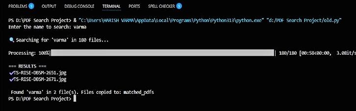
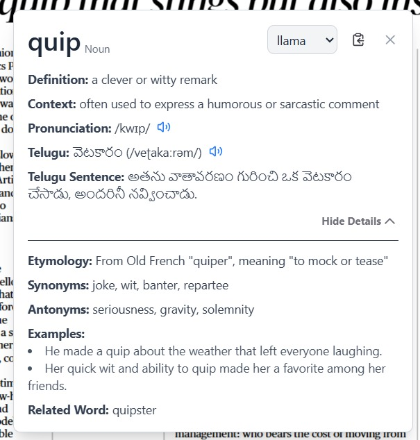
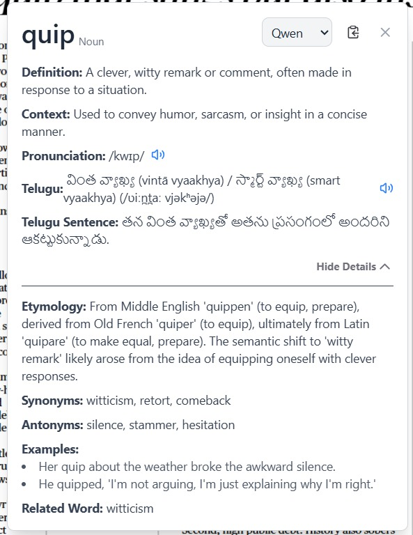
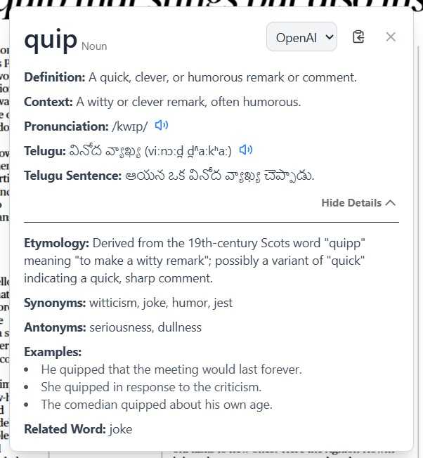
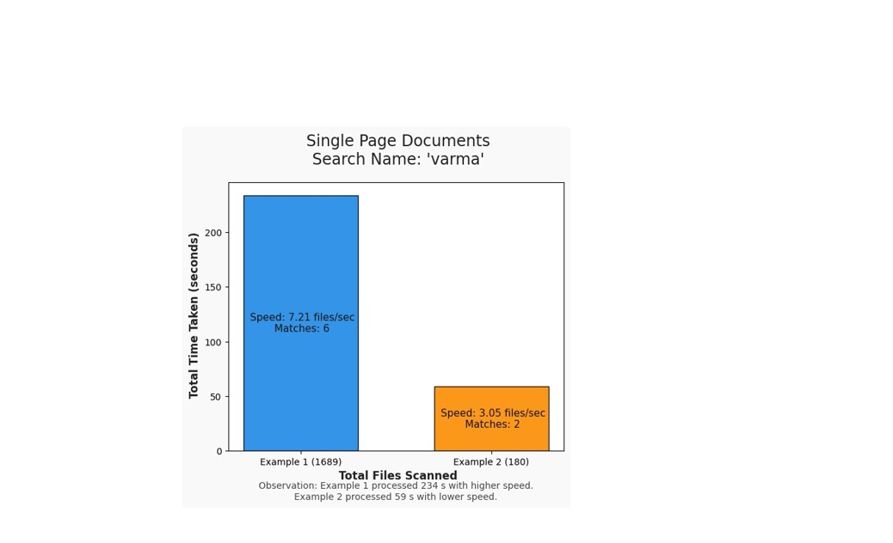
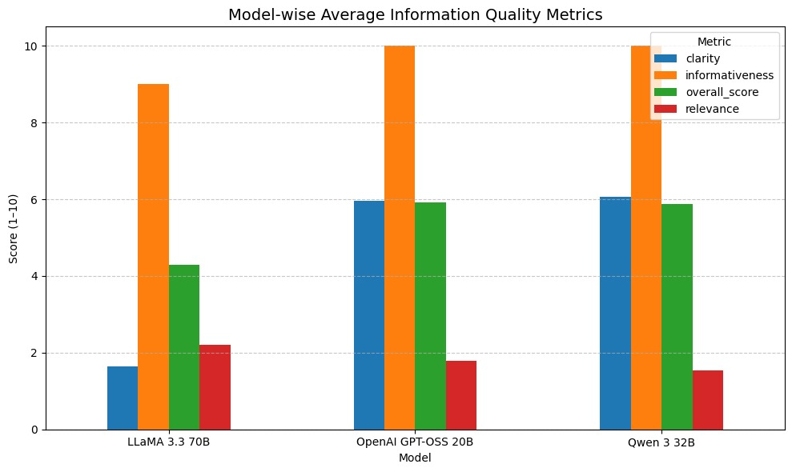
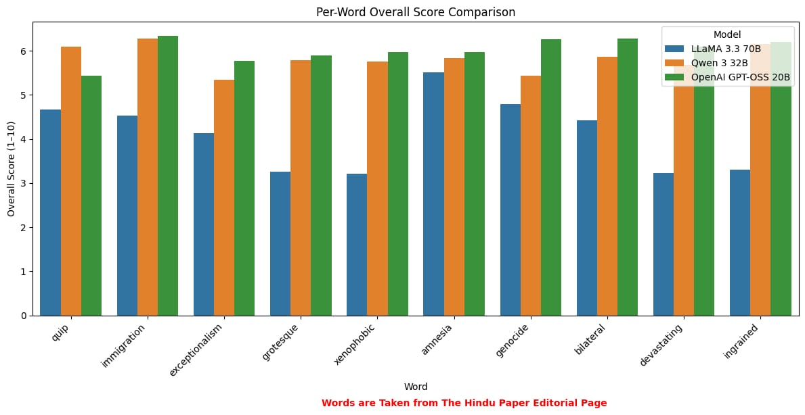

# Smart PDF Retrieval & Word Insights

## Introduction
Finding a specific PDF from hundreds or even thousands of files can be frustrating and time-consuming. This project, **“Smart PDF Retrieval & Word Insights”**, makes it easy—you just type a keyword, and it quickly finds the PDF you need.  

While reading, it’s normal to come across words you don’t know. With this project, you can simply select a word and instantly get its meaning and related information, making reading smoother and more productive.

---

## Objective
- To develop a system that quickly searches and retrieves the required PDF from a large collection using keywords.  
- To make document retrieval faster and more efficient using **Tesseract OCR** for text extraction.  
- To enhance the reading experience by providing instant word meanings and related insights using **LLM/API integration**.  
- To save users time and effort in managing and understanding large sets of PDF files.

---

## Workflow of the Project

### 1. Document Retrieval (Tesseract OCR based)
1. User inputs a keyword.  
2. System scans the folder of PDFs and images.  
3. PDF pages are converted to images using `pdf2image`.  
4. Text is extracted from images using **Tesseract OCR**.  
5. System checks for the keyword in the extracted text.  
6. If the keyword is found:
   - File is copied to `matched_pdfs` folder.  
   - Matched files are displayed to the user.  
7. If the keyword is not found, continue searching.

### 2. Word Meaning & Insights (API-based)
1. User uploads a PDF to the reader.  
2. User double-clicks a word in the PDF.  
3. Frontend sends the word to Flask backend.  
4. Backend calls **LLM APIs** (Llama / Qwen / OpenAI via Groq API) to fetch word insights.  
5. Meaning, translation, pronunciation, and examples are retrieved.  
6. A popup displays word insights on the screen.

---

## Results

### 1. PDF Retrieval From Bulk PDFs
- Quickly searches and retrieves relevant PDFs from large collections.  

### 2. Word Insights (from 3 models)
#### Llama Model
- Shows word insights using the Llama model via Groq API.   

#### Qwen Model
- Shows word insights using the Qwen model via Groq API.  

#### OpenAI Model
- Shows word insights using the OpenAI model via Groq API.  

---

## Result Analysis

### 1. PDF Retrieval From Bulk PDFs
- Efficient retrieval from bulk PDF files using OCR-based text extraction.  

### 2. Word Insights
- Model Wise Average Information Quality Metrics

- Per Word Overall Score Comparision

---

## Technologies Used
- Python  
- Flask (Backend)
- Poppler
- pdf2image  
- Tesseract OCR  
- LLM Models Via Groq API(OpenAI/Llama/Qwen)  
- ReactJS (Frontend)  

---

## Future Improvements
- Support for multiple languages in word insights.  
- Advanced ranking for retrieved PDFs based on relevance.  
- Integration with cloud storage for larger datasets.
